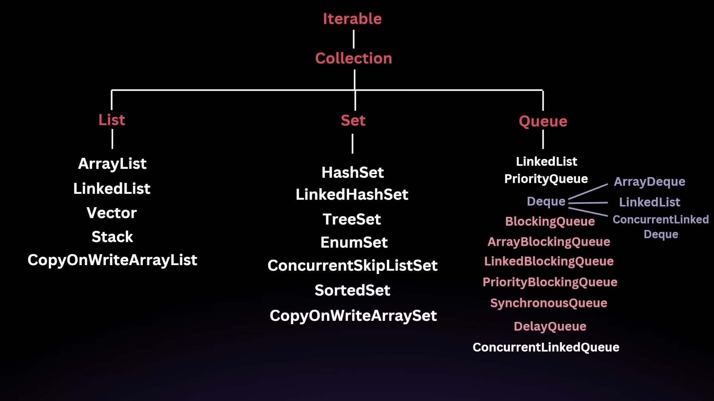

---
tags:
  - java
  - collections
  - arraylist
  - data-structures
---

# Collection Framework

Video URL: [Complete Java Collections Framework & Streams Masterclass 2024
](https://www.youtube.com/watch?v=92k5uokmW9o) by [Engineering Digest](https://www.youtube.com/@EngineeringDigest)

## Collection
- `Collection` is simply an object that represents a group of objects, known as its elements.

## Collection Framework
- It provides a set of interfaces and classes that helps to manage groups of objects.
- It is introduced in Java 2 (JDK 1.2).
- Before that `Java` used of to rely on variety of class like `Vector`, `Stack`, `Hashtable` and `Arrays` to store and manipulate groups of objects.
- Before collection framework, there was
  - `Inconsistancy` : Each class has its own implementation.
  - `Lack of interoperabiliy`: These class were not designed to work together seamlessly.
  - `No common interface`: There was no common interfaces for all those classes, which means you cannot write generic code that works with all of them.
- Benefits
  - `Unified Architecture`
  - `Inter-operability`
  - `Reuasbility`
  - `Efficiency`

## Collections Types
- Collections
  - The root interface of all other collection types.
- List
  - Duplicate or ordered collection of objects.
  - Implementation: `ArrayList`, `LinkedList`, `Vector`, `Stack`
  - Key features
    - Order Preservation
    - Index based access
    - Allows Duplicates
- Set
- Queue
- Deque
  - Double Ended Queue
- Map

## Collection Hierarchy



## List Interface
## ArrayList
- resizable array implementation of the `List` interface.
- ArrayList can grow and shrink as elements are added and removed. This dynamic resizing is achieved by `creating a new array when the current array is full and copying all elements to the new array`.
- It is implemented as an array Object references, when you add an element to the ArrayList, it is stored in the array at the next available index.
- Initial(Default) capacity is 10.
- When an element is added to the ArrayList, the following list occur
  - Check Capacity
  - Resize If necessary
    - If the internal array is full, the ArrayList will create a new array with larger capacity (usually `1.5 times` of the current capacity) and copy the elements from the old array to the new array.
  - Add the element
- Though adding an element when the ArrayList is full, the capacity of the arrayList gets increased, but removing an element does not decrease the capacity.
- Time Complexity
  - Access by index: `O(1)`
  - Insertion: `O(1)` at the end, `O(n)` at beginning/specific index or when resizing (elements need shifting)
  - Deletion at index: `O(n)`
  - Iteration: `O(n)`

### Example Code
```java
void main(String[] args) {
    ArrayList<Integer> list = new ArrayList<>();
    list.add(1);
    list.add(2);
    list.add(3);
    System.out.println(list);
    System.out.println(list.get(0));
    
    // print size
    System.out.println(list.size());
    
    // iteration using for loop
    for (int i = 0; i < list.size(); i++) {
        System.out.println(list.get(i));
    }
    // iteration using for-each loop
    for (int i : list) {
        System.out.println(i);
    }
    
    //contains
    System.out.println(list.contains(1));
    
    // remove by index
    list.remove(1);
    System.out.println(list);
    
    //insertion at index
    list.add(1, 2);
    System.out.println(list);
    
    // update by index
    list.set(1, 3);
    System.out.println(list);
    
    
    // ArrayList with initial capacity
    ArrayList<Integer> list2 = new ArrayList<>(10);
    
    
    // Access internal array to check actual capacity using reflection
    Field field = ArrayList.class.getDeclaredField("elementData");
    field.setAccessible(true);
    Object[] array = (Object[]) field.get(list2);
    System.out.println("ArrayList capacity: "+array.length);
    
    // for loop to add 11 items in list2
    for(int i = 0; i < 11; i++){
        list.add(i);
    }
    
  // the capacity of list2 will be 10*1.5 = 15
  array = (Object[]) field.get(list2);
  System.out.println("New ArrayList capacity: "+array.length);
  
  // remove single element to check capacity
  list2.remove(0);
  array = (Object[]) field.get(list2);
  System.out.println("New ArrayList capacity: "+array.length);
  
  // so the capacity remains same
  // to reduce capacity to the size of the list, we can use trimToSize() method
  list2.trimToSize();
  array = (Object[]) field.get(list2);
  System.out.println("New ArrayList capacity: "+array.length);
  
  // generate List from Arrays
  List<Integer> list3 = Arrays.asList(1, 2, 3, 4, 5);
  
  // list3 cannot be considered as arrayList, it is a nested static class of Arrays
  // list3 is a fixed-size list backed by an array - it cannot add/remove elements but can update existing ones
  System.out.println(list2.getClass().getName()); // prints java.util.ArrayList
  System.out.println(list3.getClass().getName()); // prints java.util.Arrays$ArrayList
  
  // generate list using List.of()
  List<Integer> list4 = List.of(1, 2, 3, 4, 5);
  // list4 is an immutable list created by List.of() - cannot add, remove, or update elements
  System.out.println(list4.getClass().getName()); // prints java.util.ImmutableCollections$ListN
  // not an actual ArrayList, it is a nested static class of List
  
  // convert ArrayList from List
  List<Integer> list5 = new ArrayList<>(list4);
  System.out.println(list5.getClass().getName()); // prints java.util.ArrayList
  
  // addAll method
  list5.addAll(list3);
  System.out.println(list5);
  
  // addAll method with index
  list5.addAll(0, list3);
  System.out.println(list5);
  
  // remove by index
  list5.remove(0);
  System.out.println(list5);
  
  // remove by object
  list5.remove(Integer.valueOf(1));
  System.out.println(list5);
  
  // arrayList to array
  Integer[] array = list5.toArray(new Integer[0]);
  System.out.println(Arrays.toString(array));
  
  // sort arrayList
  Collections.sort(list5);
  list5.sort(null); // same as Collections.sort(list5)
  System.out.println(list5);
}
```

### Comparator

```java
class IntegerComparator implements Comparator<Integer> {
    private boolean isAscending;
    
    IntegerComparator(boolean isAscending){
        this.isAscending = isAscending;
    }
    
    @override
    public Integer compare(Integer o1, Integer o2){
        if(isAscending)
            return o1.compareTo(o2);
        else
            return o2.compareTo(o1);
    }
}

void main() {
    IntegerComparator ascendingComparator = new IntegerComparator(true);

    IntegerComparator descendingComparator = new IntegerComparator(false);
    
    List<Integer> list = new ArrayList<>({1, 2, 3, 4, 5});
    
    // ascending sort
    list.sort(ascendingComparator);
    System.out.println(list);
    
    // descending sort
    list.sort(descendingComparator);
    System.out.println(list);
}
```

- Lamba expression example
```java
void main(){
    List<Integer> list = new ArrayList<>({1, 5, 4, 2, 3});
    
    // ascending sorting
    list.sort((a, b) -> Integer.compare(a, b));
    list.sort(Comparator.comparingInt(a -> a));
    System.out.println(list);
  
    // descending sorting
    list.sort((a, b) -> b-a);
    list.sort(Comparator.comparingInt(a -> a).reversed());
    System.out.println(list);
}
```

- Comparator.comparing method
```java
void main() {
  List<Integer> list = new ArrayList<>({1, 5, 4, 2, 3});
  Comparator.comparing ascendingCompare = Comparator.comparing(list);
  Comparator.comparing descendingCompare = Comparator.comparing(list).reversed();
  
  list.sort(ascendingCompare);
  System.out.println(ascendingCompare);
  
  list.sort(descendingCompare);
  System.out.println(descendingCompare);
}
```
- String Example

```java

class Student implements Comparator<Student {
  String name;
  double cgpa;


  @override
  public int compare(Student s1, Student s2) {
    return s1.cgpa.compareTo(s2.cgpa);
  }
  
  @overided
  public void toString() {
      return name + " " + cgpa;
  }
}

void main() {
  List<Integer> list = new ArrayList<>({1, 5, 4, 2, 3});
  Comparator.comparing ascendingCompare = Comparator.comparing(Stiudent::cgpa).thenComparing(Stiudent::name);
  Comparator.comparing descendingCompare = Comparator.comparing(list).thenComparing(Stiudent::name).reversed();

  list.sort(ascendingCompare);
  System.out.println(ascendingCompare);

  list.sort(descendingCompare);
  System.out.println(descendingCompare);
}
```

- Collections class sort method

```java
import java.util.Collections;
void main(){
try {
    Collections.sort(list, ascendingCompare);
} catch (ClassCastException e) {
    System.err.println("Cannot compare elements: " + e.getMessage());
} catch (UnsupportedOperationException e) {
    System.err.println("List cannot be modified: " + e.getMessage());
} catch (IllegalArgumentException e) {
    System.err.println("Comparator violates contract: " + e.getMessage());
}

try {
    Collections.sort(list, descendingCompare);
} catch (ClassCastException e) {
    System.err.println("Cannot compare elements: " + e.getMessage());
} catch (UnsupportedOperationException e) {
    System.err.println("List cannot be modified: " + e.getMessage());
} catch (IllegalArgumentException e) {
    System.err.println("Comparator violates contract: " + e.getMessage());
}
}
```

